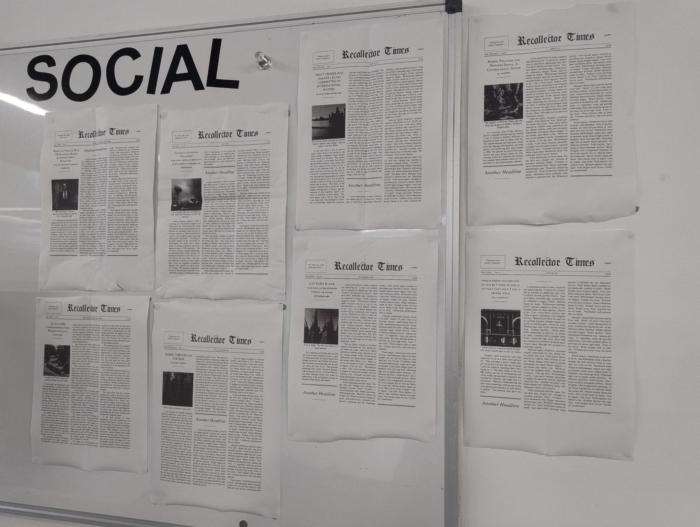

# The Recollector

## Tech
deepseek-r1:7b (with Ollama) for creating text.  
[impactframes/llama3_ifai_sd_prompt_mkr_q4km:latest](https://ollama.com/impactframes/llama3_ifai_sd_prompt_mkr_q4km) for enhancing SD prompts generated by deepseek.  
[tiny-sd](https://huggingface.co/segmind/tiny-sd) for creating images.  
[pyxel](https://github.com/kitao/pyxel) for the interface.  
I used the [Bedstead](https://bjh21.me.uk/bedstead/) font.  
LaTeX + the [newspaper](https://ctan.org/pkg/newspaper) package for making it look like a newspaper.  

I wanted an excuse to use LaTeX again for something. Everything ran on a NVIDIA Jetson AGX Orin Developer Kit and would take 2-5 minutes to complete its article ~generation~ search.

## Output
The output that people generated can be seen [here](https://github.com/DolicaAkelloEgwel/studies-show/tree/main/exhibition).

## Inspiration
These sorts of things were living rent-free in my mind for a few weeks.  
https://www.science.org/content/article/unethical-ai-research-reddit-under-fire
  
I was also motivated by a desire to learn how much you can get out of free-to-use Gen AI tools, as this is part of a student workshop I had been developing over the summer. 

## Feedback
Some of the things people said during the private viewing and the exhibition...  
"This would blow the mind of a medieval peasant."  
"Well that's a big fat lie."  
"This one's my favourite."  
"It's like a fever dream."  
