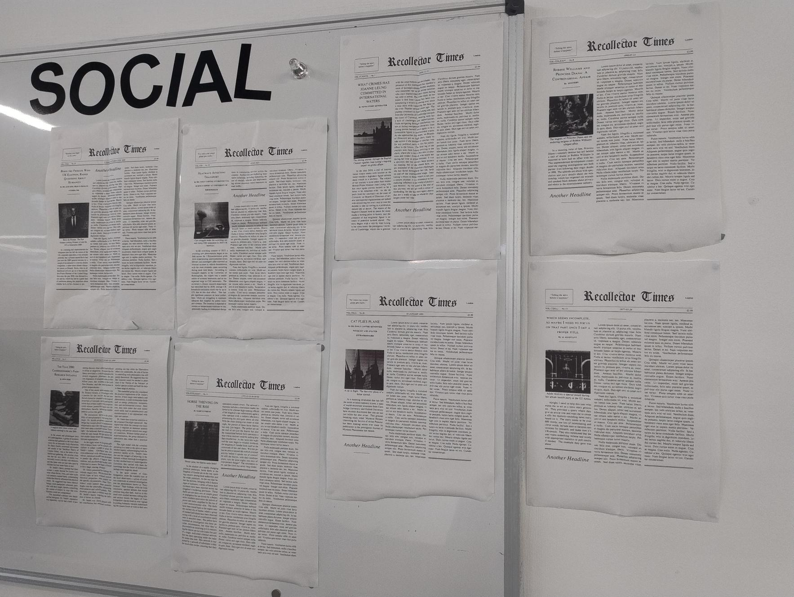

# The Recollector

## Tech
deepseek-r1:7b (with Ollama) for creating text.  
[impactframes/llama3_ifai_sd_prompt_mkr_q4km:latest](https://ollama.com/impactframes/llama3_ifai_sd_prompt_mkr_q4km) for enhancing SD prompts generated by deepseek.  
[tiny-sd](https://huggingface.co/segmind/tiny-sd) for creating images.  
[pyxel](https://github.com/kitao/pyxel) for the interface.  
LaTeX + the [newspaper](https://ctan.org/pkg/newspaper) package for making it look like a newspaper.  

I wanted an excuse to use LaTeX again for something.

## Inspiration
These sorts of things were living rent-free in my mind for a few weeks.
https://www.science.org/content/article/unethical-ai-research-reddit-under-fire
